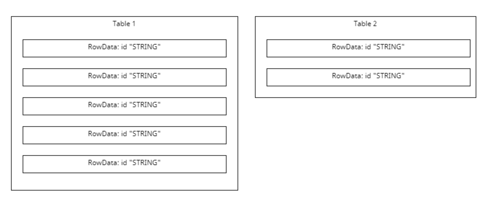
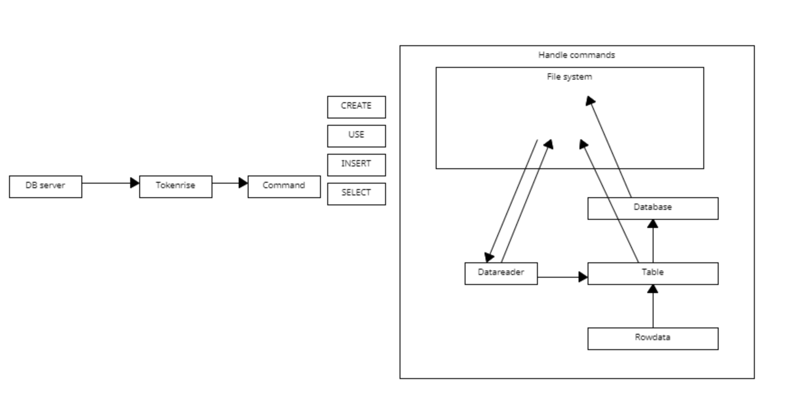

# JAVA-CW-2023
[if23696]

# DB
## General design


1. get the server and client connected:
```mvnw exec:java -Dexec.mainClass="edu.uob.DBServer"```
```mvnw exec:java -Dexec.mainClass="edu.uob.DBClient"```
or
```./mvnw clean compile```
```./mvnw exec:java@server```
```./mvnw exec:java@client```
.mvn 
maven
src
test

1. Design
READ IN->file
DATABASE,TABLE-> low letter cases
id->self added->Arraylist+"String"
```JAVA
//ArrayList<Line>
/*class Line{
    public int line;
    public String data;
    protected boolean flag;
}
*/
```
1. deal with the file
```JAVA
class DataReader{
    //1. Read Data
    readDataFromFile();
    printData();
    //-----------------


interface Storage{
    String name;//how to deal with names.
    boolean flag;

}

class Databases{
    String databaseName;
    protected boolean flag;
    Hashmap<Integer,String> tables=new Hashmap<Integer,String>();
    //Stirng is for table names. Whenever creates a new ,the Integer should always be 1 or 0
    //CREATE DATABASE;

    //DROP DATABASE;

}

class Table{
    String tableName;
    String attributeName;//the 0th row of the file/table
    public int tableSize;
    ArrayList<RowData> dataList=new ArrayList<RowData>();
    protected boolean flag;
    //CREATE TABLE;
    //DROP TABLE;

}

class RowData{
    //-----------------
    public int id;//starts from 1
    public String data;
    protected boolean flag;
    
}
```

2. Handling the COMMAND

```JAVA
public interface CommandHandler();
```JAVA
public interface CommandHandler();
<CommandType>     ::=  <Use> | <Create> | <Drop> | <Alter>|<Insert> | <Select> | <Update> | <Delete> | <Join>

```


1. dealing with whitespace
2. do the tokens


```
### Data Storage
```JAVA
interface Storage{
    String name;
    boolean flag;
    public void create;
    public void drop;
}

class Databases implements Storage{
    HashMap<Integer, String> tables;

}
class Table implements Storage{
    ArrayList<Rowdata> datas;
}
class Rowdata implements Storage{
    public int id;
    public String data;

}


class DataReader{
    //reads in the current data 

    //print them on the terminal
}

```
### HandleComments
```
interface CommandHandler
USE: switches the database against which the following queries will be run
CREATE: constructs a new database or table (depending on the provided parameters)
INSERT: adds a new record (row) to an existing table
SELECT: searches for records that match the given condition
UPDATE: changes the existing data contained within a table
ALTER: changes the structure (columns) of an existing table
DELETE: removes records that match the given condition from an existing table
DROP: removes a specified table from a database, or removes the entire database
JOIN: performs an inner join on two tables (returning all permutations of all matching records)

USE\CREATE\INSERT\UPDATE\ALTER\DELETE\DROP->related to file system
SELECT->JOIN: only output, but doesn't change the file.

```



1.delete, regenerate the table:
generate a txt.file:```database.txt```
Hashmap<String>(table name): current id
generate a txt.file:```database_delete.txt```
Hashmap<String>(table name): deleted id

## Progress
### 10/3：
1. √ Added the whole database-Table-Rowdata structures, use Datareader to read-in tab file and print them on the terminal

### 11/3:
1. √ Use the Tokenrise given to cope with commands.
2. √ change all the methods dealing with file systems to DBserver
3.  generate a txt.file and a delete.txt.file
      1. √ (tested, during the test, create a Globalstatus to track the current database and table the user is dealing with) generate new files when creating new database
      2. √ update these two files when creating new tables(used Hashmap)
    When testing, when created a new table, instead of append the new ones in the file, it overwrite it.
      3. update these two files when dealing with insert and delete in tables
          1. tables:insert/delete
          2. update the latest ID in these two files
4. √ drop for databases and files
5. √ Tests for generating folders and files and drop
6. USE methods in DATAreader
    1. √ USE->USE DATABASE,check if it is exists, set the 
    2. globalstatus, generate a new hashmap based on the current files. generate new TXT based on the hashmap.
    3. √ INSERT INTO->USE table, check if it is exists on globalDATABASE, set the globalstatus.
 7. √ insert data in Tables and update in TXT
 8. delete data in Tables and update in TXT

What BNF is DONE:
1. CREATE DATABASE/CREATE TABLE
2. DROP DATABASE/DROP TABLE
3. USE database, refer to TABLE
UPDATE, INSERT INTO, Alter, Delete refers to TABLE
```
Database:
//insert into function
updateTableLatestID(String tablename){
    1. parts[1]:empty
    ->if table-file line[0].equals("")->error:"Missing attributes"
    ->if table.file lines[1].equals("")->update to 1
    -> find the biggest index in table.datas.biggest Index
    2. parts[1]: contains number->update to parts[1]+1
}
// //given a tablename, return the id
// public int getTableID(String tablename){
//     getTable.(tablename);

//     //search for the table name in the txt:


// }

public void updateTableDeleteID( String tablename, int id){


}
public Table getTable(String tablename){
    //given a tablename, return its table using the hashmap

}
```
USE DATABASE->initialize anycurrent files in hashmap
table->
1. empty
2. only contains attribute
3. have contents


### 12/3:
Added CommandHandler.
Developing Engineering's game.


### 13/3:
1. Dealing with Command line.
    1. **USE**: done
    2. CREATE:
        '''create;''' will caused exit ERROR?
        Hasn't debug yet?
    3. DROP:Hasn't tested yet?
2. Alter
ADD: 
DROP: delete 
->DataReader->write a function to write current table back to file.
3. Today sticked with CREATE and DROP debugs!!!!!!!!!!!!!!!!!
Change the logic of dropDatabase->boolean->fixed!
**USE**->can't select a existed folder: Database folder 'ghmyrqfeyg' does not exist in the specified path.
    ->dataReader->useDatabase->>>Path ERROR
                ->addTableToFile() the databasePath was not set.--->FIXED
**DROP**--->Fixed drop database
how about drop tables?????
**CREATED**->Add already exist flag->DATABASE OK
            -> create table->doesn't do anything->Fixed
Mostly Done, small bugs
Parser Mostly Done!!!!!!

### 14/3:
  UPDATE, INSERT INTO, DELETE
```
<Insert>  ::=  "INSERT " "INTO " [TableName] " VALUES" "(" <ValueList> ")"
```
1. DONE----Deal with ignore, push to main branch
2. FIXED-----Handle the attribute ERROR->there are 2 tabs between the tokens problem->
3. FIXED----Handle the table drop ERROR->cases problem I think??
```Table with name 'ADA' does not exist.``` but the table name is ada.tab, added tolowercase()
4. **INSERT INTO** 
find the txt-> 
get and update the latest ID->
id =latest ID, data=valueList, added to the ArrayList of the table->
write the Arraylist back to file

test: why??? marks should be a table
this come out in useDatabase, so I think 
```
Database folder 'marks' does not exist in the specified path.
Database folder 'marks' does not exist in the specified path.
Database folder 'marks' does not exist in the specified path.
Database folder 'marks' does not exist in the specified path.
```
```
SQL:> INSERT INTO marks VALUES ('Simon', 65, TRUE);
[ERROR] Table doesn't exist
```
```E:\1.EDUCATION\˶ʿ-����˹�д�ѧ\Term 2\JAVA-CW-2023\cw-db\databases\edu.uob.Database@2e5d6d97marks.tab```----->FIXED

FIXED------[ERROR] invalid sentence, brackets not in pairs->
tokens ERROR->

```update current ID error```--------->updateTableLatestID ERROR

instead of using TXT to track, use .id
but what if the database already exist?

FIXED->>>>>>INSERT DONE!!!!!!!!!!!!!!!!!!!!!!!
```
name	mark	pass	
1	'Simon' 65  TRUE    
2	'Sion'	55	TRUE	
```
small bugs
5. **ALTER**
Add->already DONE, hasn't tested yet
Drop->a colmumn

DONE!!!!----------->hasn't test
   * can't find attribute name?
    *the Table attribute has been set but 

new issues??
table can be null? why???? insert into works fine
added valid name check in Condition


### 15/3:
1. √ fix bugs:
   1. FIXED!!! create table with attribute: id-attribute being ignored
      1. no! create table wtih id-attribute
      2. test in CommandHandler?????
   2. alter->server breakdown, table->null?
      1. √ test without command?->Alter ADD PASS!!!!!
      2. √ test without command?->drop PASS!!!!!
      3. √ So the ERROR occurs in CommandHandler!!!!!!!!!
    **workFlow ERROR**
    ->create->alter->OK
    ->if the table already exist->alter->can't find table!?????
    ->insert into also has this question->
    **useTable** ERROR!！！！！！！！！
    √ ->write a useTable test
    √ **useDatabase** ERROR!!!!!!!
    create->use->OK
    use->ERROR!!!!!!!!!!!!!!!!!!!!!
2. √ **EXTENDS** commandHandler->multiple classes
3. **SELECT**:data reader printout -method
 select * 
4. **workFlow ERROR**
   1. √ drop table ERROR, drop database OK->change the filePath
   2. √ attribute added in a new line->delete the added new line in addAttribute
   3. insert into->stays in the same line

5. attributes can't duplicate

### 16/3:
√ workflow problems solved->didn't added the tables to current database's hashmap
PASS 3 TESTS  ToT!!!!!!

**WHERE**
->add selected flag in row Data
selected the whole row

SELECT (WHERE)->selected flag->true
DELETE (WHERE)->flag->false

select->alterdrop in the end
delete->

1. []>[]
2. AND OR
3. have brackets
condition selector->tested


```
use testDatabase2;
INSERT INTO marks VALUES ('Simon', 65, TRUE);
```
ERROR
```select * from marks```only print name and * why?
1. √ select->alterdrop move to the end(after where condition)
   -> currently debug on select * from [] only print out the first two lines error
   -> readTabFile error???
   -> rewrite readTabFile, fixed
2. delete-> can select conditon, and can role
    -> after delete it delete it all
    ->public int AttributeIndexWithoutID ERROR
    -> if I generate a new DBdriver,
    it actually works before every changes????
    ->didn't update in insert into= =
3. √ insert into break down->breakdown IDFilePath null

simplist delete done!!!!!
simplist select->
    ->reset select colmun

why? create attribute can't added???

still outbound problem???
change the create with attribute be with alter ADD


---------> I mean...why it fixed?
create tables error again???
Fundamental tests:
go through every work flow:
* √ create with attribute doesn't work
* index error -> delete error(where)-> Table attributeID thing
->done

UPDATE(WHERE)->finish but hasn't tested yet

### 17/3:

√ trying to insert too many (or too few) values into a table entry
√ attempting to create a database or table using a name that already exists
√ creating a table with duplicate column names (or trying to add a column with an existing name)
attempting to remove the ID column from a table
changing (updating) the ID of a record
queries on non-existent databases, tables and columns
queries which use invalid element names (e.g. reserved SQL keywords)
Errors should NOT be returned in situations where the user performs:

a valid query that has no matches: just return the column names and no data rows
a query to delete columns/tables/rows/database that contain data: the user should be free to perform destructive actions
a comparison of two different data types: attempt a sensible comparison if possible, return blank results if not

test update

### 18/3:
Working on the join functoin

### 19/3:
added restrictions based on the workshop

√ trying to insert too many (or too few) values into a table entry
√ attempting to create a database or table using a name that already exists
√ creating a table with duplicate column names (or trying to add a column with an existing name)
√ attempting to remove the ID column from a table
√ changing (updating) the ID of a record
√ queries on non-existent databases, tables and columns
√ queries which use invalid element names (e.g. reserved SQL keywords)

√ drop->create table->already exist???-? problem with drop


problem with ' '
problem with (name=='Simon')AND(fire>=2);->re tokenrise


deal with AND OR without brackets:
1. get attributes ID
2. replace every token in that 

### 20/3:

25 failures T T
debug with transcript

update gets wrong
some select gets wrong 


### 21/3:

AND OR
SELECT * FROM marks WHERE (pass == FALSE) AND (mark > 20);
SELECT * FROM marks WHERE (pass==FALSE) AND (mark>20);
SELECT * FROM marks WHERE (pass==FALSE) AND (mark > 20);
SELECT * FROM marks WHERE pass==FALSE AND mark>20;->PASS!!!!!!!!!
SELECT * FROM marks WHERE mark>35;->PASS
SELECT * FROM marks WHERE PASS==FALSE;->PASS

select delete update->condition


UPDATE marks SET mark=90 WHERE name == 'Simon';->PASS
UPDATE marks SET mark = 45 WHERE name == 'Simon';->infinite loop????->PASS

SELECT * FROM marks WHERE (pass==FALSE) AND (mark>20);


only update?!
UPDATE marks SET mark=90 WHERE (pass==FALSE) AND (mark>20);
UPDATE marks SET mark=90 WHERE (pass==FALSE) AND (mark > 20);
UPDATE marks SET mark=90 WHERE pass==FALSE AND mark>20;
UPDATE marks SET mark=90 WHERE (pass==FALSE) AND (mark>20);


<Delete> ::=  "DELETE " "FROM " [TableName] " WHERE " <Condition>
DELETE FROM marks WHERE pass==FALSE AND mark>20;
DELETE FROM marks WHERE (pass==TRUE) AND (mark < 90);


---
SELECT (WHERE)->can select colmun
DELETE (WHERE)
UPDATE(WHERE)->finish

JOIN (WHERE)
---
## Feedback

48 tests->70% * persentage

Total Tests Passed: 47/60 (see separate file for features not successfully implemented).
Fairly steady and consistent implementation of features over the duration of project.
Moderate penalty applied for significant, rapid 'un-agile' increase in size of codebase.
Penalty applied for pushing some inappropriate file types onto GitHub - check your repo.
Moderate penalty applied for a number of code quality issues - see separate file for more details.

**quality?**


# STAG

## General design

**task 1:**
1. game entities->.dot->provided parser

* Locations: 
  * Paths(one-way or both-way)
  * character
  * artefacts
  * furniture
* Artefacts: things to be collected
* Furniture: things can't be collected
* Characters: people to interact
* Players: user(multiple in the future)

.DOT:
* locations subgraph-> define locations
    * cluster
      * location(name+description)
        * artefacts(name+description)
        * furniture(name+description)
        * characters(name+description)
* paths subgraph-> define paths

1. actions->XML->provided parser

inventory (or inv ):
get: picks up
drop: put down the artefacts
goto: move
look:
   1. prints names and descriptions of entities 
   2. lists paths to other locations


**task 2:**
actions-> interact with game entities

**task 3:** input->natural language->interact with looks
   1. Case Insensitivity
   upper and lower cases doens't matter
   2. Decorated Commands
   ```chop tree with axe```和```please chop the tree using the axe```-> chop tree axe
   3. Word Ordering
   ```chop tree with axe``` ```use axe to chop tree```-> unordered sentece
   4. Partial Commands
   minimum:a trigger phrase and at least one subject  ->```unlock trapdoor``` ```unlock with key```
   5. Extraneous Entities
   6. Ambiguous Commands
   7. Composite Commands
   no compound commands?
   8. Error messages

---

### 23/4:

starting on entity Parser

### 25/4:
1. String entityType = entityDetails.getAttribute("shape"); entytyTpe -null-FIXED
2. 

### 26/4：
finish all the basic commands
deal with "cut down"->sliding windows
